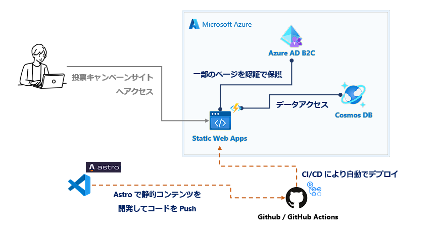

# セルフペースドハンズオン

## 💫 概要

このハンズオンでは、認証が必要な投票キャンペーンの静的サイトの開発を通して以下を学びます。

- **Azure Static Web App と Azure AD B2C を使ってコードをほぼ書かずに認証を組み込む**

 

静的コンテンツやウェブアプリケーションをホストするサービス "**Azure Static Web Apps**" と、コンシューマーユーザー向けの認証基盤 "**Azure AD B2C**" を活用し、実装をほとんどせずに認証を組み込むことが体験できます。

また、Azure Static Web Apps は GitHub Actions の CI/CD のワークフローを自動生成できるため、コードを書くことなく CI/CD も体験できます。

このハンズオンで作る内容は以下になります。

## 📄 ハンズオンの構成

全体構成は以下となります。

| タイトル                                                                                   | 概要 |
| ------------------------------------------------------------------------------------------ | ---- |
| [🧪 静的サイトと API を実装](./setup-application.md)                       | 投票キャンペーンのサイトとその API を実装します。 |
| [🧪 Azure Static Web Apps を構成する](./setup-static-web-apps.md)         | 投票キャンペーンサイトをホストする Azure Static Web Apps を構成します。 |
| [🧪 Azure AD B2C テナントを構成する](./setup-ad-b2c.md)                    | 認証基盤として利用する Azure AD B2C を構成します。|
| [🧪 静的サイトに認証を組み込む](./setup-auth.md)                            | 投票キャンペーンサイトに認証を組み込みます。 |
| [🧪 Cosmos DB リソース作成・設定](./setup-cosmos-db.md)                    | データベースのリソースを作成します。|
| [🧪 ログインユーザーに依存するデータを作成・取得する](./create-authenticated-data.md) | 投票キャンペーンサイトの API からデータベースにアクセスする実装をします。 |
| [💎 Appendix: Azure AD B2C のビルトイン画面のカスタマイズ](./customize-ad-b2c-builtin-ui.md) | Azure AD B2C の認証画面をカスタマイズします。|
| [💎 Appendix: ログインユーザーに依存しないデータを取得する](./get-public-data.md)                 | データ取得の応用パターンを実装します。|

## 🛠️ 事前準備

このハンズオンは、開発の環境・ツールとして以下を利用します。

- Visual Studio Code
- Microsoft Azure
- GitHub の利用

ハンズオンをはじめるにあたっては、以下をご参照して環境を準備します。

- [🛠️ 開発の準備](./preparation.md)

## 🧑‍💻 Let's Get Started

[🧪 静的サイトと API を実装](./setup-application.md) からハンズオンを開始しましょう。

 

---

[⏭️ 「静的サイトと API を実装」へ進む](./setup-application.md)
