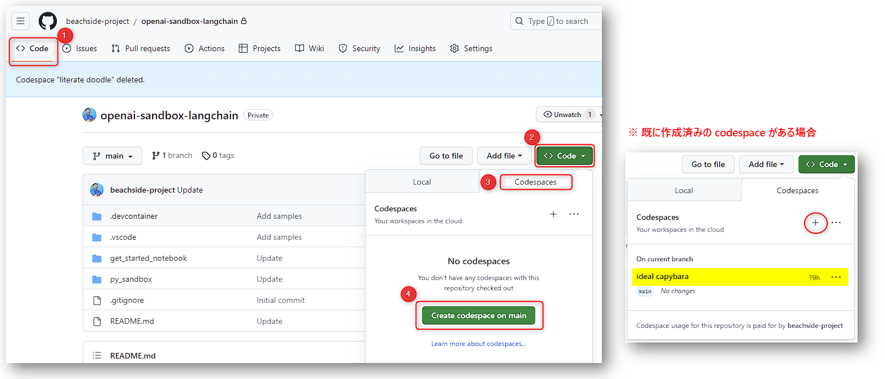
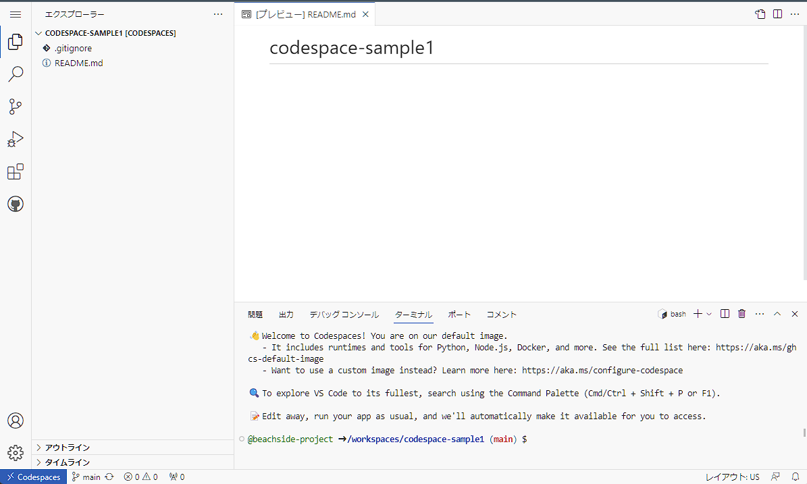
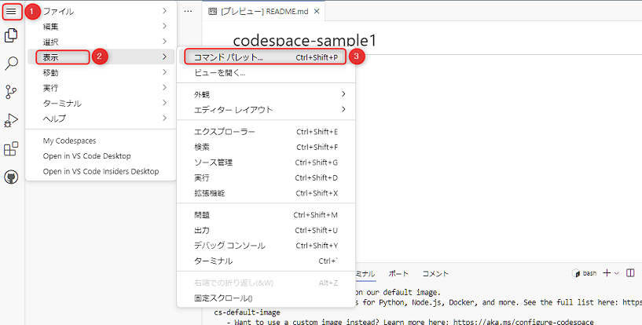
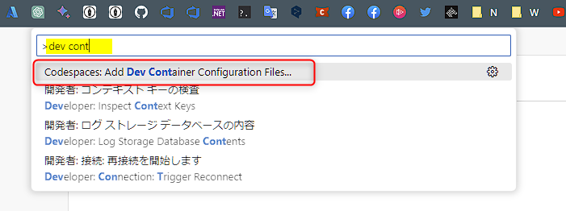
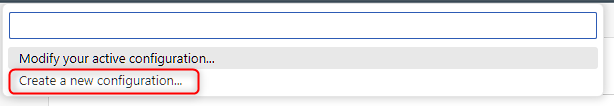
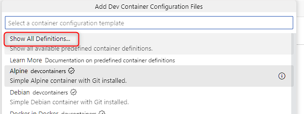
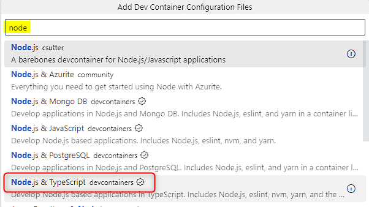
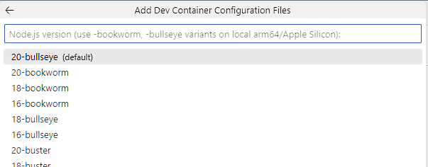
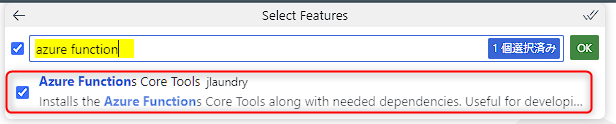
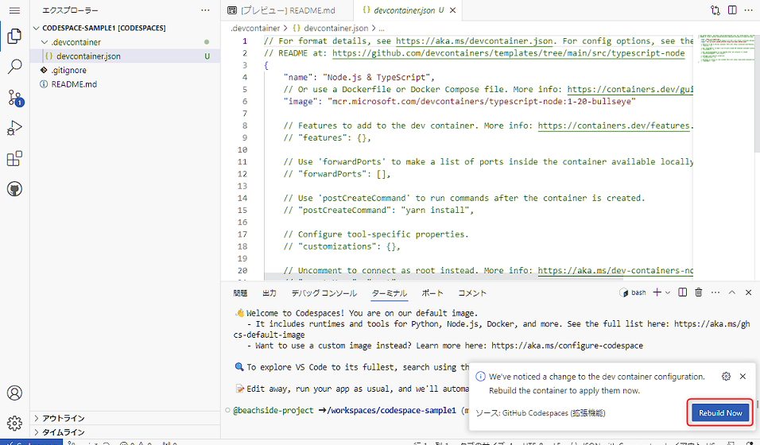

# Codespaces のセットアップ

## Codespaces とは

GitHub Codespaces は、ブラウザ上で VS Code などのエディタで開発およびデバッグを行うことができるサービスです。

CPU などのリソースは、GitHub 上のリソースを利用するため、自分の PC のリソースを使うことなく開発を行うことができます。

GitHub の個人アカウントでも無料枠がついているため、気軽にお試し頂くことが可能です。

- [Codespaces | GitHub](https://github.co.jp/features/codespaces)
- [GitHub Codespaces の概要 - GitHub Docs](https://docs.github.com/ja/codespaces/overview)
- [GitHub Codespaces の料金体系について | GitHub Docs](https://docs.github.com/ja/billing/managing-billing-for-github-codespaces/about-billing-for-github-codespaces)

 

## Codespaces のセットアップ

今回のハンズオンでは Node / npm の環境が必要となります。Codespaces の環境を利用することで、ローカルの PC にインストールする必要がなくなります。

また、開発環境に応じた特定のツールなどをインストールした状態を保存して再利用が可能のため、プロジェクトごとに最適な開発環境をチームで統一することも可能です。

### Codespaces の起動

GitHub の Code タブで、`Code` ボタンをクリックし、`Create codespace on main` をクリックします。

※ 過去に codespace を作成済みで残っている場合は、下図右側を参考に + ボタンをクリックします。

 

ブラウザ (環境によっては VS Code) で Codespaces が起動します。ブラウザ上で VS Code を使って開発ができる状態になりました。ここで起動している CPU やメモリは、GitHub 上のリソースで動作しています。

 

### Node の環境をセットアップ

Codespaces では、VS Code の拡張機能である [Dev Containers](https://code.visualstudio.com/docs/devcontainers/containers) を使って環境を構築し、再利用可能な状態を保持できます。

左上のハンバーガーメニューをクリック > 表示 > コマンドパレット をクリックします。

 

コマンドパレットに `dev cont` と入力し、`Codespaces: Add Dev Container Configuration Files...` をクリックします。

 

`Create a new configuration...` をクリックします。

 

Container の定義を選択する画面になりますので、`Show All Definitions...` をクリックします。

 

"node" と入力して、`Node.js & TypesScript devcontainers` をクリックします。

 

提供されている OS とバージョンを先駆することが可能です。今回は default のものをクリックします。

 

"Select Features" の画面になります。ここでは任意のツールをセットアップすることが可能です。今回は Azure Functions の開発もしますので、"auzre function" と入力して、`Azure Functions Core Tools` をチェックし、"OK" をクリックします。

 

これで環境が構成された devcontainer.json が作成されます。画面の右下に通知が表示されますので、`Revuild Now` をクリックして container をリビルドします。

※ 通知が消えた場合は、コマンドパレットで `Codespaces: Rebuild Container` を実行することでリビルドできます。

 

これで Node の開発環境が準備できました。`node -v` や `npm -v` を実行するとインストールされているバージョンが確認できます。

 

これでセットアップは完了です。

このほかにも多様なカスタマイズを加えて開発環境を整えることが可能です。ご興味がありましたら、以下のドキュメントをご参照ください。

- [GitHub Codespaces のドキュメント - GitHub Docs](https://docs.github.com/ja/codespaces)

---

[📋 目次へ戻る](../README.md)
