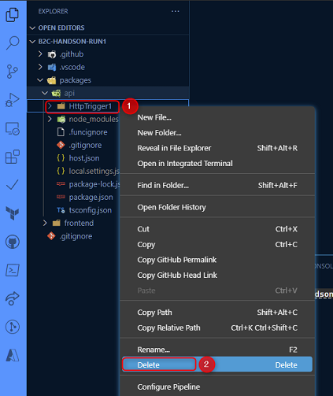
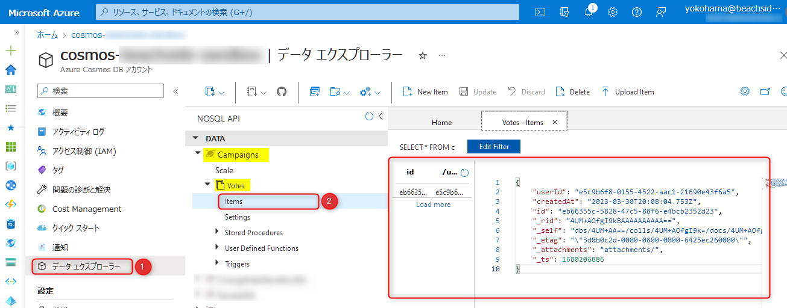

# 🧪 ログインユーザーに依存するデータを作成・取得する

このチャプターでは、 Azure Functions で API の実装をカスタマイズし、認証情報を含むデータを Cosmos DB に保存します。  
Static Web Apps に API をデプロイしていると、事前設定の必要なくログインユーザーの情報がリクエストヘッダーから簡単に取得できます。

この機能を使って、キャンペーンへの投票ボタンをマイページに実装してみましょう。

1. Function の作成と設定
1. API のプログラムで認証情報を取得し、Cosmos DB に保存
1. フロントエンドのプログラムを編集し、マイページから API にリクエスト
1. Static Web Apps・Cosmos DB で動作確認

## 1. Function の作成と設定

以前のチャプターで動作確認のために作成した Function は不要になるため、まずはこれを削除します。  
VS Code でコードのフォルダを開き、`/packages/api` 直下の `HttpTrigger1` フォルダを右クリック (①) →「Delete」をクリック (②) して削除します。




投票 API 用の Function を作成します。  
[静的サイトと API を実装 - 3. Azure Functions で API を実装](./setup-application.md#3-azure-functions-で-api-を実装) と同様に設定しますが、対話式で `Provide a function name` と聞かれたら今回は `CreateMyVote` と入力してください。

生成された Function コードのうち `packages/api/CreateMyVote/function.json` を下記のように編集して、 `POST /api/auth/votes` としてこの API にアクセスできるようにします。

```diff
  {
    "bindings": [
      {
        "authLevel": "anonymous",
        "type": "httpTrigger",
        "direction": "in",
        "name": "req",
+       "route": "auth/votes",
        "methods": [
-         "get",
          "post"
        ]
      },
      {
        "type": "http",
        "direction": "out",
        "name": "res"
      }
    ],
    "scriptFile": "../dist/CreateMyVote/index.js"
  }
```

## 2. API のプログラムで認証情報を取得し、Cosmos DB に保存

`CreateMyVote` Function でリクエストヘッダーからログインユーザーの ID を取得し、ユーザーに紐づく投票データとして Cosmos DB に保存します。

ターミナルを開き、Cosmos DB にアクセスするための SDK をインストールします。

```bash
pushd "packages/api"
npm install @azure/cosmos
popd
```

`packages/api/cosmos.ts` というファイルを作成します。

```bash
# ファイル追加のコマンド:
# Mac の場合:
touch packages/api/cosmos.ts

# Windows - PowerShell の場合:
New-Item packages/api/cosmos.ts

# Windows -コマンドプロンプトの場合
type nul > packages/api/cosmos.ts 
```

`cosmos.ts` に下記のコードを記述します。

```ts
import { CosmosClient } from "@azure/cosmos";

const client = new CosmosClient(process.env.COSMOS_CONNECTION);
export const database = client.database("Campaigns");
```

ここでの `process.env.COSMOS_CONNECTION` は環境変数の `COSMOS_CONNECTION` を参照するので、後述のステップで値を設定します。

つぎに、 `packages/api/CreateMyVote/index.ts` の内容を下記に置き換えます。

```ts:packages/api/CreateMyVote/index.ts
import { AzureFunction, Context, HttpRequest } from "@azure/functions";
import { database } from "../cosmos";

const httpTrigger: AzureFunction = async function (
  context: Context,
  req: HttpRequest
): Promise<void> {
  // x-ms-client-principal からユーザー情報取得
  const clientPrincipal = req.headers["x-ms-client-principal"];
  if (!clientPrincipal) {
    context.res = {
      status: 401,
    };
    return;
  }

  // database オブジェクトを使って投票データを作成
  const encoded = Buffer.from(clientPrincipal, "base64");
  const { userId } = JSON.parse(encoded.toString("ascii"));
  const createdAt = new Date();

  // ユーザー ID と投票日時を保存する
  const { resource } = await database
    .container("Votes")
    .items.create({ userId, createdAt });

  context.res = {
    status: 201,
    body: {
      vote: resource,
    },
  };
};

export default httpTrigger;
```

`x-ms-client-principal` リクエストヘッダー値に含まれる `userId` を取得し Cosmos DB に保存するコードです。  
今回は同じユーザーが何度も投票可能なアプリケーションを作るので、投票データを特定するために作成日時とともに保存しています。

`x-ms-client-principal` で取得できるクライアントプリンシパルデータについては、以下ドキュメントで詳細が確認できます。

- [Azure Static Web Apps でのユーザー情報へのアクセス | Microsoft Learn](https://learn.microsoft.com/ja-jp/azure/static-web-apps/user-information?tabs=javascript#client-principal-data)

## 3. フロントエンドのプログラムを編集し、マイページから API にリクエスト

投票 API が準備できたので、フロントエンドのプログラムを編集して、マイページに投票ボタンを設置します。

ここで投票ボタンの UI を React コンポーネントとして作成してみましょう。  
API リクエストは Astro コンポーネントでも実現できますが、Astro プロジェクトでは任意の UI ライブラリでコンポーネントを記述できるので、より宣言的に書けるように React を活用します。

まずはターミナルにて、React コンポーネント実装に必要なパッケージをインストールします。

```bash
pushd "packages/frontend"
npm install react react-dom @astrojs/react @types/react @types/react-dom
popd
```

`packages/frontend/astro.config.mjs` の内容を下記で置き換えます。

```mjs
import { defineConfig } from "astro/config";

// https://astro.build/config
import react from "@astrojs/react";

// https://astro.build/config
export default defineConfig({
  integrations: [react()],
});
```

ここまでで React コンポーネント実装の準備ができました。  
次は `packages/frontend/src/components/Vote.tsx` を作成します。

```bash
# ファイル追加のコマンド:
# Mac の場合:
touch packages/frontend/src/components/Vote.tsx

# (Windows) PowerShell の場合:
New-Item packages/frontend/src/components/Vote.tsx

# (Windows) コマンドプロンプトの場合
type nul > packages/frontend/src/components/Vote.tsx
```

`Vote.tsx` に React コードを記述します。

```tsx
export default function Vote() {
  // `POST /api/auth/votes` を実行する
  async function submit() {
    const response = await fetch("/api/auth/votes", {
      method: "POST",
    });
    if (response.ok) {
      alert("投票が送信されました！");
    }
  }

  // エントリーを投票するためのボタンを設定する
  return <button onClick={submit}>投票する</button>;
}
```

`packages/frontend/src/pages/mypage.astro` の内容をすべて消し、下記を記述して投票ボタンを配置します。

```astro
---
import Layout from "../layouts/Layout.astro";

// Vote.tsx コンポーネントの取込み
import Vote from "../components/Vote";
---

<Layout>
  <h2>マイページ</h2>
  <!-- クライアント JS を含むコンポーネントのため `client:load` 属性を付与する -->
  <Vote client:load />
</Layout>
```

また、全体的なスタイルを整えておきます。  
`packages/frontend/src/layouts/Layout.astro` の内容を削除し、下記のように置き換えます。

```astro
---
import "../../styles/layout.css";
---

<html lang="ja">
  <head>
    <meta charset="utf-8" />
    <link rel="icon" type="image/svg+xml" href="/favicon.svg" />
    <meta name="viewport" content="width=device-width" />
    <meta name="generator" content={Astro.generator} />
    <title>投票キャンペーン</title>
  </head>
  <body>
    <header>
      <h1>投票キャンペーン</h1>
      <nav>
        <a href="/">ホーム</a>
        <a href="/mypage">マイページ</a>
      </nav>
    </header>
    <main>
      <slot />
    </main>
  </body>
</html>
```

index.css, layout.css, mypage.css の3つの CSS を以下のコマンドを参考に配置します。

```bash
# Mac の場合:
mkdir -p touch packages/frontend/styles
touch packages/frontend/styles/index.css
touch packages/frontend/styles/layout.css
touch packages/frontend/styles/mypage.css

# Windows - PowerShell の場合:
mkdir packages/frontend/styles
New-Item packages/frontend/styles/index.css
New-Item packages/frontend/styles/layout.css
New-Item packages/frontend/styles/mypage.css

# Windows -コマンドプロンプトの場合
mkdir "packages/frontend/styles"
type nul > packages/frontend/styles/index.css
type nul > packages/frontend/styles/layout.css
type nul > packages/frontend/styles/mypage.css
```

それぞれの CSS のコードは以下です。

`packages/frontend/styles/index.css`

```css
.count {
  background-color: #ecf2f8;
  padding: 30px 120px;
  margin-bottom: 30px;
  border-radius: 4px;
  color: #626e87;
}

.vote a {
  padding: 8px;
}
```

`packages/frontend/styles/layout.css`

```css
body {
  display: flex;
  flex-direction: column;
  align-items: center;
  min-height: 100vh;
  max-width: 800px;
  margin: 0 auto;
  color: #384254;
  font-family: sans-serif;
}

a {
  text-decoration: none;
  color: #0039a9;
  font-weight: bold;
}

header {
  width: 100%;
  display: flex;
  align-items: center;
  justify-content: space-between;
  padding: 20px 0;
}

h1 {
  margin: 0;
  font-size: 1rem;
}

nav {
  display: flex;
  align-items: center;
  justify-content: flex-end;
  gap: 30px;
}

main {
  display: flex;
  flex-direction: column;
  justify-content: center;
  align-items: center;
  flex-grow: 1;
  padding-bottom: 100px;
}
```

`packages/frontend/styles/mypage.css`

```css
h2 {
  font-size: 1rem;
  font-weight: normal;
}

button {
  background-color: transparent;
  border: none;
  cursor: pointer;
  outline: none;
  padding: 20px 80px;
  appearance: none;
  font-size: 1rem;
  background-color: #0039a9;
  border-radius: 40px;
  color: #fff;
  margin-top: 20px;
}
```

トップページ・マイページのコンポーネントでもそれぞれ CSS ファイルを読み込みます。

`packages/frontend/src/pages/index.astro`

```diff
---
+ import "../../styles/index.css";
import Layout from '../layouts/Layout.astro';
import Card from '../components/Card.astro';
---

<Layout title="Welcome to Astro.">
// 以下省略
```

`packages/frontend/src/pages/mypage.astro`

```diff
---
+ import "../../styles/mypage.css";
import Layout from "../layouts/Layout.astro";

// Vote.tsx コンポーネントの取込み
import Vote from "../components/Vote";
---

<Layout>
  <h2>マイページ</h2>
  <!-- クライアント JS を含むコンポーネントのため `client:load` 属性を付与する -->
  <Vote client:load />
</Layout>
```

これでマイページの実装は完了です。

## 4. Static Web Apps・Cosmos DB で動作確認

Static Web App へ環境変数を設定後、コードを push することで GitHub Actions によって自動でデプロイをして動作確認をします。

### 4-1. Static Web Apps で Cosmos DB の接続文字列を構成

API から Cosmos DB へアクセスするための接続文字列を環境変数で設定する必要があります。  

Cosmos DB 接続文字列の値は Azure ポータルの Cosmos DB リソース画面から確認できます。メニュー「キー」を開き、 「プライマリ接続文字列」の右側にある目のアイコンをクリックして文字列を表示してから値をコピーします。  
文字列を表示せずにコピーすると「*」でコピーされるのでご注意ください。


<br>

Azure ポータルで Static Web Apps リソースのメニュー「構成」を開き、「アプリケーション設定の追加」で下記の値を入力します。

- **名前**: `COSMOS_CONNECTION`
- **値**: Cosmos DB 接続文字列

詳細の手順は、[静的サイトに認証を組み込む - 1. Static Web App の構成を追加](./setup-auth.md#1-static-web-app-の構成を追加) の通りです。


### 4-2. 動作確認

[静的サイトと API を実装 - 4. コードを GitHub のリポジトリへ push](./setup-application.md#4-コードを-github-のリポジトリへ-push) の通りにコードを push し、GitHub Actions のワークフローの完了を待ちます。


デプロイと環境変数の設定が完了したら Static Web App にアクセスして動作を確認します。

マイページを表示し「投票する」ボタンをクリックして、 Cosmos DB のデータが更新されていることを確認します。

Cosmos DB でのデータの確認は、Azure ポータルで Cosmos DB のリソースを開き、「データエクスプローラー」をクリック (①) し、今回作成した「Campaigns」→「Votes」内の「Item」をクリック (②) して確認可能です。



<br>

## ✨ Congratulations ✨

おめでとうございます 🎉 このチャプターではログインユーザーに依存するデータを API で取得し、Cosmos DB に保存しました。  
Azure Functions では、Static Web Apps 機能により認証処理を実装する必要なくユーザー ID 等の情報を簡単に取得でき、
SDK を使えばシンプルなコードで Cosmos DB を操作できます。

次のチャプターでは、Azure AD B2C ビルトインの認証画面をカスタマイズします。

---

[⏮️ 前へ](./setup-cosmos-db.md) | [📋 目次](../README.md) | [⏭️ 次へ](./customize-ad-b2c-builtin-ui.md)
