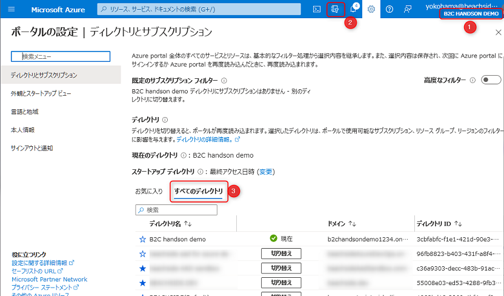
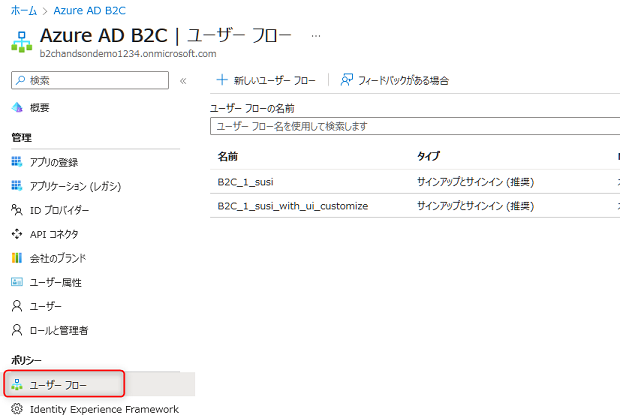
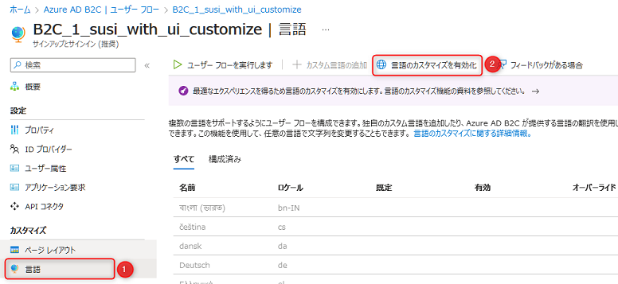
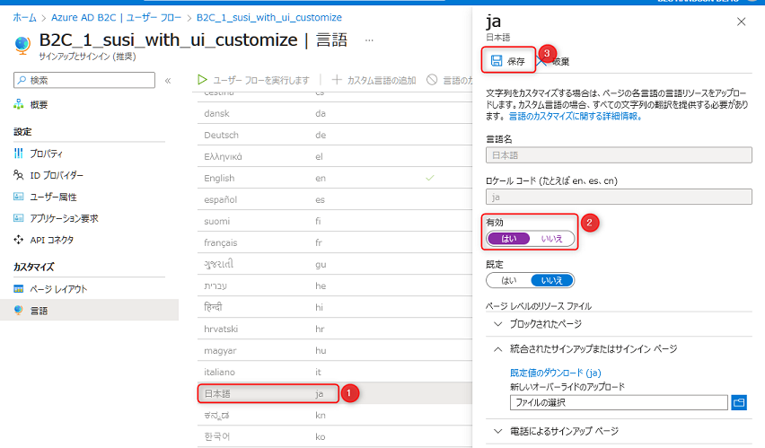
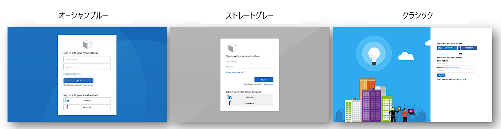
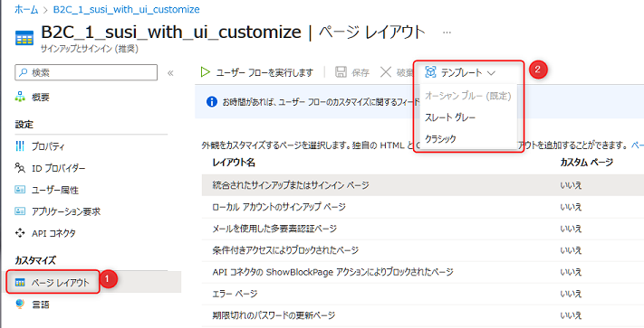
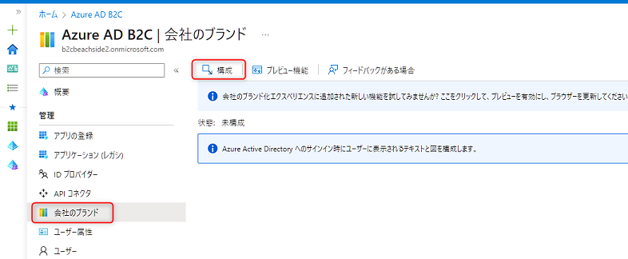

# 💎 Appendix: Azure AD B2C のビルトイン画面のカスタマイズ

ここでは、認証時に表示されるビルトインの UI のカスタマイズ方法を説明します。

1. UI を日本語化
1. UI のカスタマイズ
1. 本格的な UI のカスタマイズをするには

言語はデフォルトで英語になっていますが、日本語に変えることが可能です。

Azure ポータルで B2C テナントを開きます。右上のテナント名を確認 (①) します。テナントが異なる場合は上部の「ディレクトリとサブスクリプション」アイコンをクリック (②) →「すべてのディレクトリ」をクリック (③) して、B2C テナントへ切り替えます。

 

B2C を開き、メニュー「ユーザーフロー」をクリックして、カスタマイズするユーザーフローをクリックします。

 

「言語」をクリック (①) → 「言語のカスタマイズを有効化」をクリック (②)します。

 

「日本語」をクリック (①) → ja の設定画面が表示されますので、「有効」を「はい」にして (②) 、上部の「保存」をクリック (③) すると、Azure で用意されているデフォルトの日本語が有効化されます。

 

ローカライズの仕組みや「既定」の変更、「ページレベルのリソースファイル」からページごとに文言を個別にカスタマイズについては、以下のドキュメントをご参照ください。

- [Azure Active Directory B2C での言語のカスタマイズ | Microsoft Learn](https://learn.microsoft.com/ja-jp/azure/active-directory-b2c/language-customization?pivots=b2c-user-flow)

## 2. UI のカスタマイズ

ここでは UI のカスタマイズ方法を説明します。

### ページレイアウトの変更

B2C では、デフォルトで3種類のページレイアウトが用意されており、変更が可能です。

Azure ポータルで B2C のリソースを開き、メニュー「ユーザーフロー」をクリックしてカスタマイズするユーザーフローをクリックします。

 

「ページレイアウト」をクリック (①) → 上部の「テンプレート」をクリックしてテンプレートを変更することができます。

### 背景・会社ロゴの変更

背景 (Background Image) と会社ロゴ (Banner Log) の変更も可能です。

B2C のメニュー「会社ブランド」をクリック →「構成」をクリックして変更することが可能です。

詳細については、以下のドキュメントをご参照ください。

- [Azure Active Directory B2C 内のユーザー インターフェイスをカスタマイズする](https://learn.microsoft.com/ja-jp/azure/active-directory-b2c/customize-ui?pivots=b2c-user-flow)

## 3. 本格的な UI のカスタマイズをするには

「2. UI のカスタマイズ」では簡易な UI の変更方法を説明しましたが、HTML/CSS/JavaScript を構成してより柔軟な UI の変更も可能です。ここではドキュメントの紹介のみとさせていただきますので、ご興味がありましたらご参照ください。

- [Azure Active Directory B2C で HTML テンプレートを使用してユーザー インターフェイスをカスタマイズする](https://learn.microsoft.com/ja-jp/azure/active-directory-b2c/customize-ui-with-html?pivots=b2c-user-flow)

## ✨ Congratulations ✨

おめでとうございます 🎉 ここでは言語の変更方法と UI のカスタマイズ方法を説明しました。シンプルな変更であれば Azure ポータルで操作するだけで変更が可能です。

次のチャプターでは、API の利用の応用編としてログインユーザーに依存しないデータを Cosmos DB  から取得して画面を構成します。

----

[⏮️ 前へ](./create-authenticated-data.md) | [📋 目次](../README.md) | [⏭️ 次へ](./get-public-data.md)
