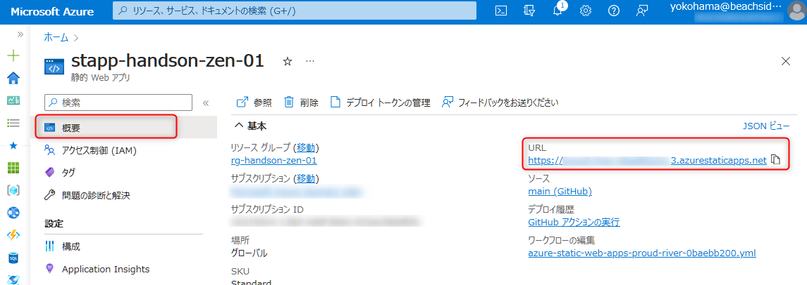

# 💎 Appendix: ログインユーザーに依存しないデータを取得する

このチャプターでは、ログインユーザーに依存しないデータを Cosmos DB から取得して画面を構成します。  
Astro ではアプリケーションビルド時にデータを fetch して静的サイトの内容に組み込むことができます。以前のチャプターで実装した要認証画面での fetch では `client:load` が必要でしたが、公開画面の場合はより簡単に実現できます。

この機能を使って、投票データの合計件数をトップページに表示してみましょう。

1. Function の作成と設定
1. API のプログラムで Cosmos DB からデータを取得
1. フロントエンドのプログラムを編集し、ビルド時に API リクエスト
1. Static Web Apps で動作確認
1. GitHub Workflow を編集し、デプロイを定期実行する

## 1. Function の作成と設定

投票合計件数を取得する Function を新規作成します。

[ログインユーザーに依存するデータを作成・取得する - 1. Function の作成と設定](./setup-application.md#3-azure-functions-で-api-を実装) の手順に従い、`Provide a function name` には `GetVotesCount` と回答してください。

また、 `packages/api/GetVotesCount/function.json` を下記の通り編集して `GET /api/votes/count` でアクセス可能にします。

```diff
{
  "bindings": [
    {
      "authLevel": "anonymous",
      "type": "httpTrigger",
      "direction": "in",
      "name": "req",
+      "route": "votes/count",
      "methods": [
-        "get",
-        "post"
+        "get"
      ]
    },
    {
      "type": "http",
      "direction": "out",
      "name": "res"
    }
  ],
  "scriptFile": "../dist/GetVotesCount/index.js"
}
```

## 2. API のプログラムで Cosmos DB からデータを取得

`/packages/api/GetVotesCount/index.ts` を下記の内容で置き換え、投票データの合計件数を返します。

```typescript
import { AzureFunction, Context } from "@azure/functions";
import { database } from "../cosmos";

const httpTrigger: AzureFunction = async function (
  context: Context
): Promise<void> {
  const { resources } = await database
    .container("Votes")
    .items.readAll()
    .fetchAll();

  context.res = {
    body: {
      count: resources.length,
    },
  };
};

export default httpTrigger;
```

これで API の実装は完了です。  
フロントエンドの実装に移る前に、ひとまずこの状態でコードを push し Function をデプロイしておきます。Astro でのビルド時に、fetch 先の API が既に存在している必要があるためです。

## 3. フロントエンドのプログラムを編集し、ビルド時に API リクエスト

`packages/frontend/src/pages/index.astro` を下記に置き換え、データ fetch と表示を行います。

```astro
---
import "../../styles/index.css";
import Layout from "../layouts/Layout.astro";

// `GET /api/votes/count` を実行する
const response = await fetch(`${import.meta.env.API_BASE_URL}/api/votes/count`);
const { count } = await response.json();
---

<Layout>
  <div class="count">
    現在の投票数は {count} 件です
  </div>
  <div class="vote">
    <a href="/mypage">マイページ</a>で投票してみよう
  </div>
</Layout>
```

`import.meta.env.API_BASE_URL` は環境変数です。  
フロントエンドで参照される環境変数は GitHub Workflow で設定できます。 `.github/workflows` 直下に生成されている yml ファイルで下記のように23行目あたりにある `uses: Azure/static-web-apps-deploy@v1` の下に追記します。

※ インデントがずれないようご注意ください。

```diff
  - name: Build And Deploy
    id: builddeploy
    uses: Azure/static-web-apps-deploy@v1
+   env:
+     API_BASE_URL: {Static Web AppsのURL}
    with:
      # 以下省略
```

`{Static Web AppsのURL}` は実際のリソースの値に置き換えてください。Azure ポータルの Static Web Apps リソース画面「概要」メニューの「URL」で確認できます。



<br>

## 4. Static Web Apps で動作確認

もう一度コードを push してデプロイを行います。GitHub Actions のビルドステップで先ほど作成した API が実行され、レスポンスを元に静的サイトが構築されます。  
完了したら、トップページを開いて現在の投票合計件数が表示されていることを確認します。

## 5. GitHub Workflow を編集し、デプロイを定期実行する

これまでの実装で、マイページから各ユーザーが実行した投票の合計件数をトップページで確認できるようになりました。  
ただし投票合計件数はアプリケーションビルド時に取得しているため、GitHub Actions が実行されたタイミングでのみ更新されます。main ブランチへの push が実行トリガーとなっていますが、それに加えて毎日決まった時間に実行するようにしてみましょう。

`.github/workflows` 直下の yml ファイルに下記を追記します。

※ インデントがずれないようご注意ください。

```diff
on:
  push:
    branches:
      - main
  pull_request:
    types: [opened, synchronize, reopened, closed]
    branches:
      - main
+  schedule:
+    - cron: '0 0 * * *'
```

このように記述すると、毎日 0:00 にこのワークフローが実行され、サイトが最新化されます。

GitHub Actions の定期実行については、下記ドキュメントで詳細が確認できます。

- [ワークフローをトリガーするイベント - GitHub Docs](https://docs.github.com/ja/actions/using-workflows/events-that-trigger-workflows#schedule)

この状態でコードを push し、一度デプロイが完了した後にマイページから投票を行い、次の 0:00 以降にトップページにアクセスして投票合計件数が増えていることを確認します。

## ✨ Congratulations ✨

おめでとうございます 🎉 このチャプターではログインユーザーに依存しないデータを API で取得し、公開ページを GitHub Actions でのビルド時に生成しました。
Static Web Apps は GitHub Actions と連携してビルド・デプロイを行うため、 Workflow の設定をカスタマイズすればサイト最新化のトリガーも柔軟に設定できます。

---

[⏮️ 前へ](./customize-ad-b2c-builtin-ui.md) | [📋 目次](../README.md)
