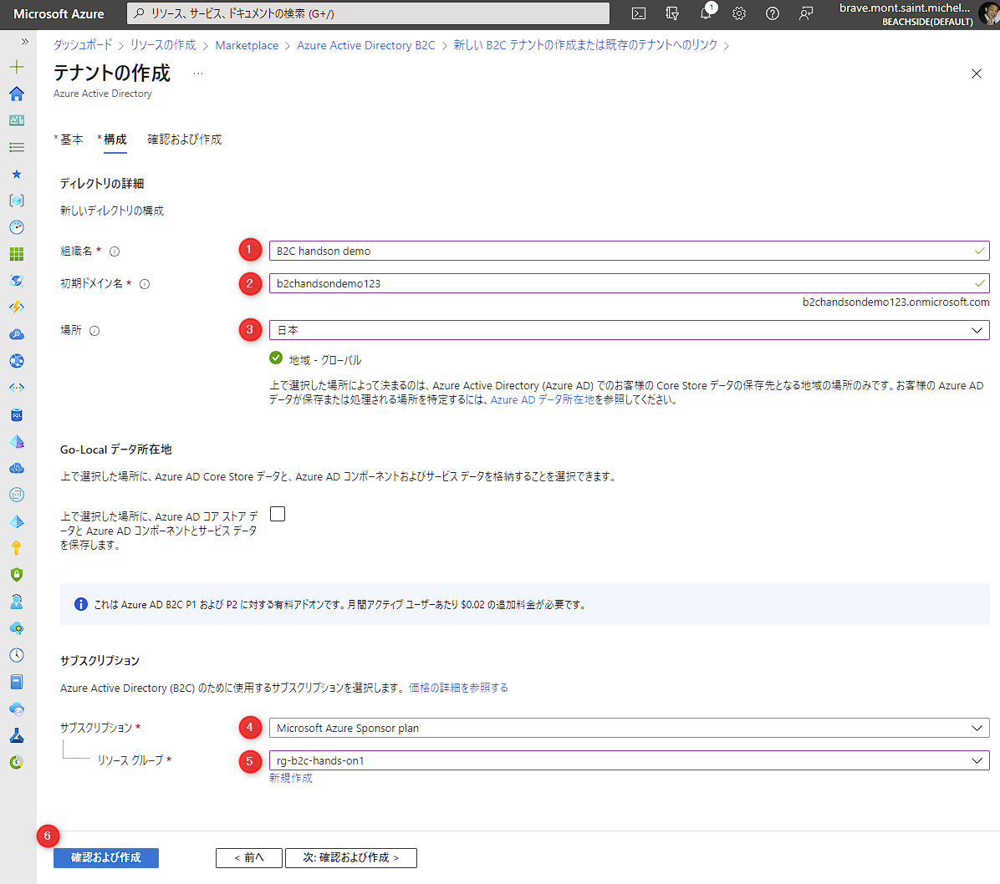

# 🧪 Azure AD B2C テナントを構成する

このチャプターでは、コンシューマーユーザー向けの認証基盤である Azure AD B2C テナントを作成し、認証に必要な設定を構成します。

1. B2C のリソースの作成
1. アプリを構成
1. ユーザーフローの作成
1. B2C でメモしておく情報を確認

## 1. B2C のリソースの作成

Azure ポータルで Azure AD B2C のテナントを作成します。

Azure ポータルで左上の「リソースの作成」をクリック (①) →検索で「b2c」と入力 (②) →「Azure Active Directory B2C」をクリックします (③)。

 

「Azure Active Directory B2C」をクリックします。

 

「作成」をクリックします。

 

「新しい Azure AD B2C テナントを作成する」をクリックします。

 

以下を参考に B2C テナントの情報を入力します。

- **組織名** (①): 任意の組織名を入力します。B2C テナントを開いたときに Azure ポータルの右上に表示されます。
- **初期ドメイン** (②): 任意のドメインを入力します。グローバルでユニークになる必要があります。
- **場所 (③)**: 日本を選びます。
- **サブスクリプション** (④): 任意のサブスクリプションを選択します。
- **リソースグループ**: 「Azure Static Web Apps を構成する」の章で作成したリソースグループを選択します。
- 入力が完了したら「確認及び作成」をクリックします (⑥) 。

 

検証に成功したことを確認し、「作成」をクリックします。

 

B2C テナントの作成が完了したら、リソースグループを開き B2C テナントをクリックします。

 

現在 Azure ポータル右上に表示されている現在開いているテナント名は Static Web Apps を作成したテナント名が表示されています。  
「Open B2C tenant」をクリックしすると B2C テナントへ移動し、テナント名の表示も変ります。  
今後、Static Web Apps を操作する時と B2C を操作する時では、テナントを切り替える必要がありますのでご注意ください。

 

別タブでテナントが切り替わり B2C テナントが表示されます。Azure ポータルの右上も B2C のテナント名が表示されています。

 

## 2. アプリを構成

先述で作成した B2C テナントで、フロントエンドのアプリの認証に必要な設定をします。

### 2-1. アプリの登録

「アプリの登録」をクリック (①) → 「新規登録」をクリック (②) します。

 

以下を参考に入力します。

- **名前** (①): 任意の名前を入力します。
- **サポートされているアカウントの種類** (②): 図にあるように一番下を選択します。
- **アクセス許可** (③): チェックを付けます。
- 入力が完了したら「登録」をクリック (③)します。

 

### 2-2. クライアントシークレットの作成

登録したアプリが表示されますので、「証明書とシークレット」をクリック (①) → 「新しいクライアントシークレット」をクリック (②) します。

 

「クライアントシークレットの追加」ブレードが表示されます。説明を任意に入力して「追加」をクリックします。

 

作成したシークレットの値が表示されますので、コピーのボタンをクリック (下図赤枠) してメモしておきます。以降表示されないので注意してください。後ほど利用します。

 

### 2-3. アプリの情報をメモ

フロントエンドで利用する B2C の情報を任意の場所にメモしておきます。必要な情報は、以下の2つです。

- **シークレット**: 先述の操作でコピーした値。
- **クライアント ID**: アプリの「概要」をクリック (①) すると、「アプリケーション (クライアント) ID」が表示されます。この値です。
  

 

## 3. ユーザーフローの作成

サインイン / サインアップに使うユーザーフローを定義します。

Azure ポータルは「アプリの登録」が開かれているので、下図の赤枠の部分をクリックして B2C のメニューに戻ります。

 

B2C のメニューで「ユーザーフロー」をクリック (①) → 「新しいユーザーフロー」をクリック (②) します。

 

「ユーザーフローのタイプを選択する」で「サインアップとサインイン」を選択 (①) → 「バージョン」は「推奨」を選択 (②) → 「作成」をクリック (②)します。

 

作成の画面が表示されますので、以下を参考に入力します。

- **名前**: 「susi」と入力します (①)。
- **ローカルアカウント**: 「Email signup」にチェックを入れます。
- **詳細を表示** をクリックします。

 

**詳細を表示** をクリックし、以下図のように「表示名」の二箇所にチェックを入れて「OK」をクリックします。

 

作成の画面に戻り、画面下部の「作成」をクリックして作成します。作成すると、ユーザーフローが表示されますのでクリックします。

 

「ユーザーフローを実行します」をクリック (①) すると、右側に URL が表示 (②) されます 。この "wellKnownOpenIdConfiguration" の URL の値をメモしておきます。

 

## 4. B2C でメモしておく情報を確認

フロントエンドの認証を構成する際に必要な情報は、 2-3. アプリの情報をメモ「2-3. アプリの情報をメモ」の2つと、「3. ユーザーフローの作成」でメモした以下3つになります。

- アプリのシークレット
- アプリのクライアント ID
- wellKnownOpenIdConfiguration の URL

## ✨ Congratulations ✨

おめでとうございます 🎉 ここでは B2C テナントを作成し、認証で必要な設定を構成しました。

次のチャプターでは、json ファイルを構成するだけで静的サイトに認証を組み込みます。

----

[⏮️ 前へ](./setup-static-web-apps.md) | [📋 目次](../README.md) | [⏭️ 次へ](./setup-auth.md)
