# 🧪 静的サイトと API を実装

このチャプターでは、クラウド上へデプロイするサンプルの静的サイトと API を実装します。

1. GitHub でリポジトリの作成とクローン
1. Astro で静的サイトを実装
1. Azure Functions で API を実装
1. コードを GitHub のリポジトリへ push

## 1. GitHub でリポジトリの作成とクローン

今回実装するコードを管理するリポジトリを作成し、ローカル環境にクローンします。

まず、GitHub にサインインした状態で、右上の「+」をクリックし「New repository」をクリックします。

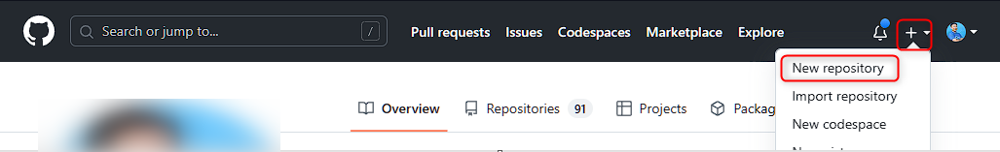

<br>

"Create a new repository" の画面が表示されます。  
以下を参考に入力し、最後に「Create repository」をクリック (⑤)してリポジトリを作成します。

- **Owner** (①): 今回利用するものを選択します。
- **Repository name** (②): 任意の名前を入力します。
- visibility は **Private** を選びます (③) 。
- **Add .gitignore** (④): `Node` を選択します。

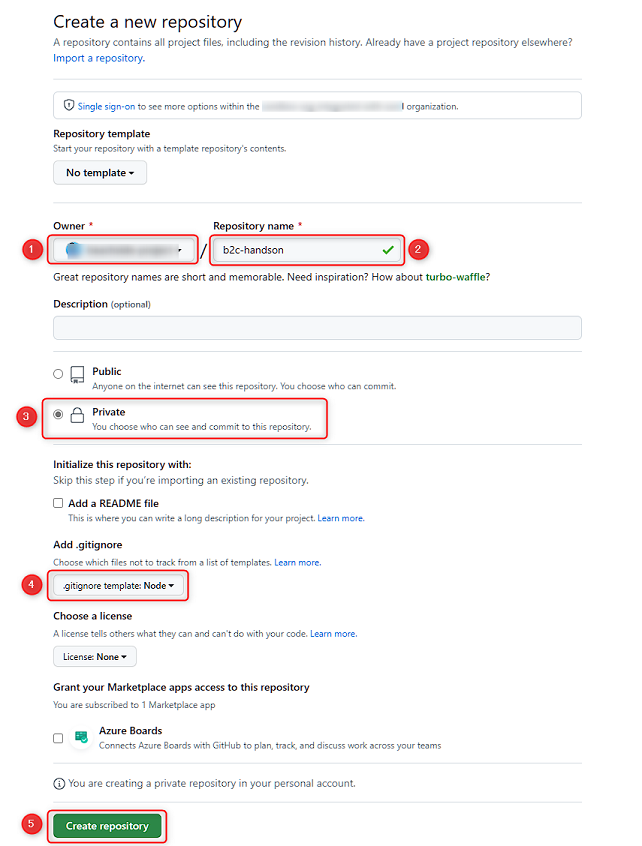

<br>

作成したリポジトリが表示されます。「Code」をクリックし (①) 、Local タブ内の HTTP タブで URL のコピーボタンをクリック (②) します。後述の `git clone` コマンド実行時に使います。

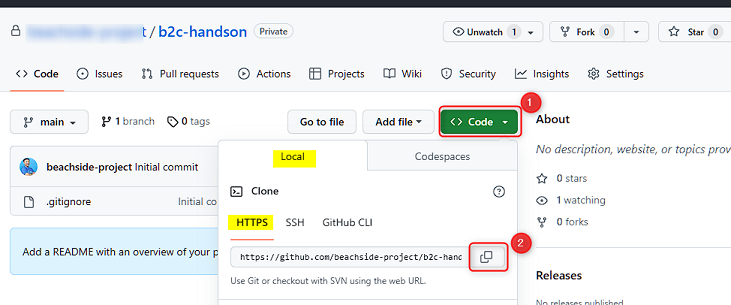

<br>

任意のターミナルを開き、今回のワークショップで使うフォルダを開きます。

> `cd` コマンドでフォルダを移動します。下図は `C:\repo` から `C:\repos\temp` へ移動した時の例。

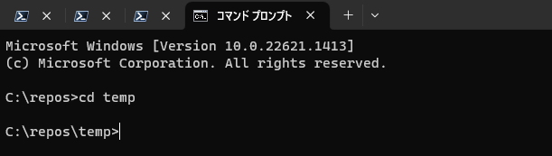

<br>

`git clone` コマンドを使ってリポジトリをクローンします。実行するコマンドは以下です。

```bash
git clone <先述でコピーしたリポジトリの URL>
```

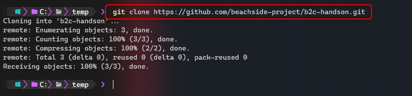

※ git clone でエラーが出る場合は、以下を参考にトラブルシューティングを行ってください。

- [https://docs.github.com/ja/repositories/creating-and-managing-repositories/troubleshooting-cloning-errors](https://docs.github.com/ja/repositories/creating-and-managing-repositories/troubleshooting-cloning-errors)

<br>

クローンしたフォルダに移動し、VS Code でフォルダを開きます。VS Code を開く際は以下のコマンドで開けます。  
VS Code は、リポジトリをクローンしたフォルダが開いた状態になります。

```bash
code .
```

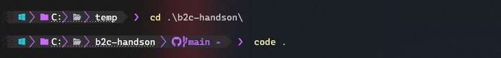

<br>

ローカル環境で開発する準備が整いましたので、次は静的サイトと API を実装します。

## 2. Astro で静的サイトを実装

ここでは [Astro](https://docs.astro.build/en/core-concepts/framework-components/) というフレームワークを使って静的サイトを構築します。

### 2-1. Astro プロジェクトの作成

先述でリポジトリをクローンしたフォルダを開いた VS Code で「Terminal」→「New Terminal」をクリックしてターミナルを開きます。

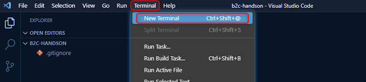

<br>

以下のコマンドを実行して Astro のプロジェクトをセットアップします。

```bash
npm create astro@latest
```

対話形式になっているので、以下を参考に入力します。

- **Need to install the following packages Ok to proceed? (y)**: `y`
- **Where should we create your new project?**: `packages/frontend`
- **How would you like to start your new project?**: `Include sample files (recommended)`
- **Install dependencies? (recommended)**: `Yes`
- **Do you plan to write TypeScript?**: `Yes`
- **How strict should TypeScript be?**: `Strict (recommended)`
- **Initialize a new git repository? (optional)**: `No`

VS Code の Explorer で `packages\frontend` を開くと、Astro のプロジェクトが作成されていることが確認できます。

### 2-2. 認証時の動作確認ためのページの追加

デフォルトではトップページのみが作られるため、後の作業で利用するページを作ります。

VS Code の Explorer で `packages\frontend\src` 直下の `pages` フォルダを右クリックし「New File」をクリックしてファイルを作成します。  

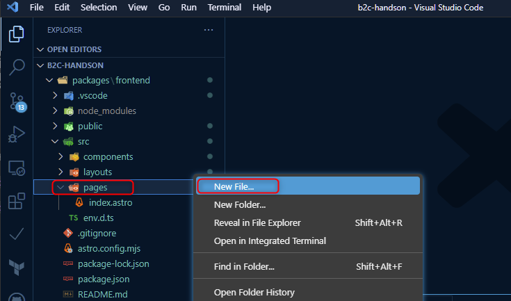

<br>

続いて以下を実施します。

- 追加するファイル名は `mypage.astro` にします。追加された `mypage.astro` は、`pages` 直下にあることを確認します。
- ファイルを追加後、index.astro を開いてコードを全てコピーし、mypage.astro に貼り付けます。
- mypage.astro を開き8行目を以下図のように `<h1>マイページ</h1>` と書き換えます。

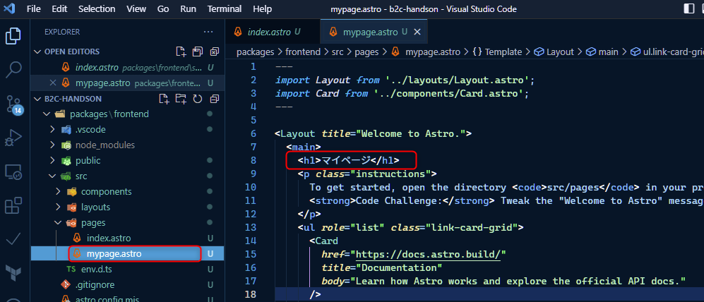

<br>

### 2-3. 静的サイトをローカルデバッグで動作確認

ローカルデバッグして動作確認を行います。

VS Code のターミナルで以下のコマンドを実行して起動します。

- `cd packages/frontend` を実行
- `npm run start` を実行 (Codespaces で実行している場合は  `npm run start -- --host 0.0.0.0` を実行)
- 起動すると Local の URL が表示されますので、ブラウザでアクセスします。(下図だと `http://127.0.0.1:3000/`)

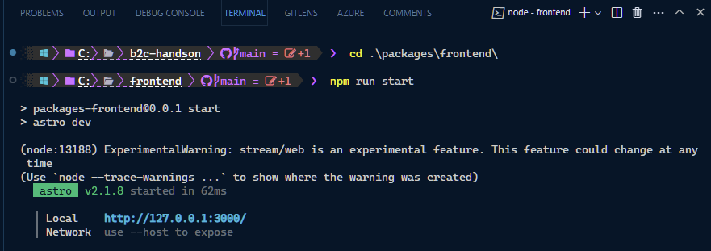

<br>

ローカルの URL のページと `mypage` にアクセスできることを確認します。

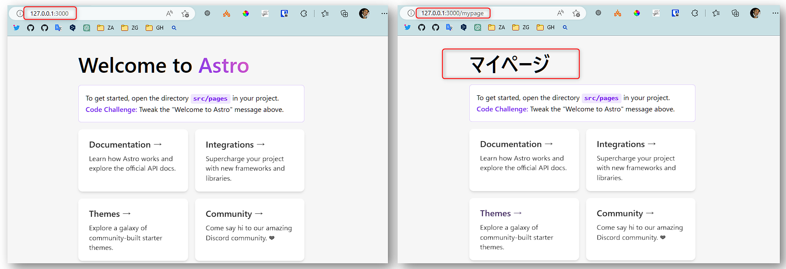

<br>

動作が確認出来たら VS Code のターミナルで `Ctrl` + `C` キーを押してデバッグ実行を停止します。
> で停止できます。

## 3. Azure Functions で API を実装

ここでは、Azure Functions でサンプルの API を実装します。コードをほぼ書くことなく実装しますので、Azure Functions の経験が無くても問題ありません。

最初に API 用のフォルダを作成します。VS Code の Explorer で `packages` を右クリック →「New folder」をクリックします。

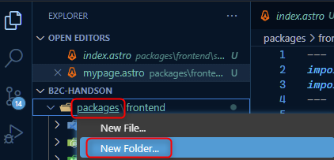

<br>

以下図のように `packages` 直下に `frontend` と `api` の2つのフォルダがあることを確認します。

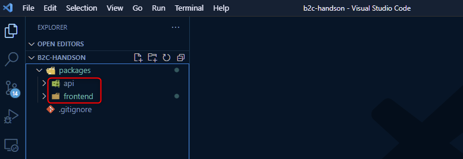

<br>

Azure Functions のプロジェクトを作成します。VS Code のメニュー「View」→「Command Palette」をクリックします。

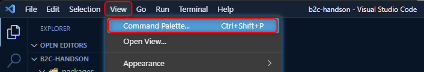

<br>

コマンドパレットで「functions create」と入力して以下を選びます。`Azure Functions: Create New Project...` をクリックします。

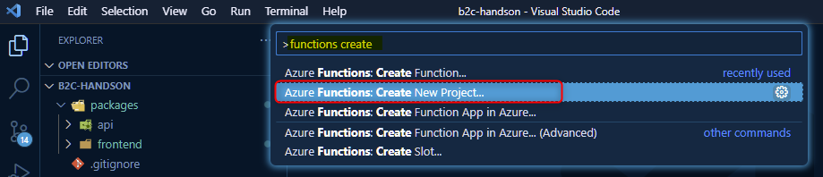

<br>

以降対話式になりますので、以下を参考に入力を進めます。

- **Select the folder that will contain your function project**: `Browse` をクリックし、`packages` → `api` のフォルダを選択します。
- **Select a language**: `TypeScript`
- **Select a TypeScript programming model**: `Mode V3`
- **Select a template for your projects first function**: `HTTP trigger`
- **Provide a function name**: この章では `HttpTrigger1` (デフォルト値) のままで `Enter` キーを押します。
- **Authorization level**: `Anonymous`

入力が完了すると、`api` フォルダ直下に Azure Functions の API が生成されます。index.ts が API の実装部分となり、クエリ文字列パラメーターかリクエストボディにある `name` を返すコードになっています。

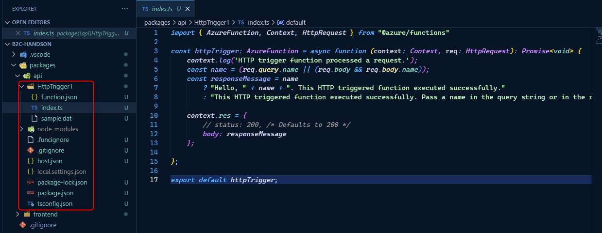

<br>

Azure Functions は、ここでは動作確認をせず、Azure Static Web App をデプロイした際に動作確認をします。  
ここではこれ以上詳しく触れませんが、ご興味がありましたら以下のドキュメントで Azure Functions の概要を確認できます。

- [Azure Functions の概要 | Microsoft Learn](https://learn.microsoft.com/ja-jp/azure/azure-functions/functions-overview)

## 4. コードを GitHub のリポジトリへ push

ここまで実装したコードを GitHub のリポジトリへ push します。

> **🚧 参考: 後述のコミットや push の操作時に Git の "user.name" と "user.email" に関するエラーが出た場合、ローカル git の設定に不足があります。以下のドキュメントを参考に設定をします。**  
> [ユーザ名とメールの設定 - ローカルのGit設定](https://githubtraining.github.io/training-manual/#/ja/05_local_git_configs?id=%e3%83%a6%e3%83%bc%e3%82%b6%e5%90%8d%e3%81%a8%e3%83%a1%e3%83%bc%e3%83%ab%e3%81%ae%e8%a8%ad%e5%ae%9a)


VS Code の Source control をクリック (①) し、コミットメッセージには「静的サイトと API を追加」と入力 (②)し、「Commit」をクリック (③) します。


<br>

「Sync Changes」をクリックすると、GitHub のリポジトリへ push されます。  
push がエラーになりエラーメッセージも不明の場合は、コマンドで `git push` を実行してエラーメッセージを確認し対処します。

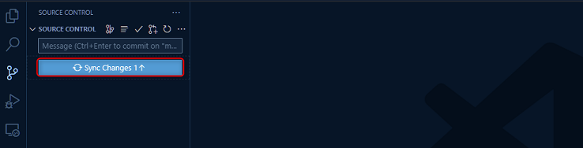

<br>

ブラウザで GitHub のリポジトリを確認し、コードが push されていることを確認します。

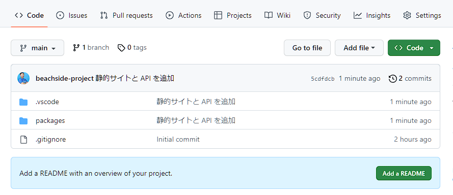

<br>

## ✨ Congratulations ✨

おめでとうございます 🎉 ここでは Astro を使った静的サイトの実装と、Azure Functions で API の実装が完了しました。

次のチャプターでは、Azure Static Web Apps を使ってクラウド上にこの静的サイトと API をデプロイして動作確認を行います。

----

[📋 目次](../README.md) | [⏭️ 次へ](./setup-static-web-apps.md)
