# 🧪 静的サイトに認証を組み込む

このチャプターでは、Azure AD B2C の認証を、静的サイトに組み込みます。  
トップページは誰でもアクセス可能、マイページは認証が必要になるようにします。

1. Static Web App の構成を追加
1. プログラムで認証を構成
1. Azure AD B2C で設定を追加
1. Static Web Apps で動作確認

## 1. Static Web App の構成を追加

ブラウザで Azure ポータルを開き、Static Web App のリソースを開きます。右上にテナント名が表示されますので、B2C のテナントではないことに注意します。

「構成」をクリック (①) し、アプリケーション設定の「追加」をクリックします (②)。

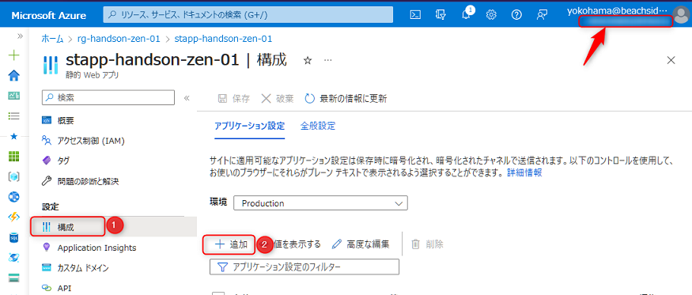

<br>

「アプリケーション設定の追加」ペインが表示されますので、以下を参考に入力して「OK」をクリックします。

- **名前**: `B2C_CLIENT_ID`
- **値**: Azure AD B2C でメモした情報の "アプリのクライアント ID" の値

もう一度アプリケーション設定の「追加」をクリックし、以下を参考に入力して「OK」をクリックします。

- **名前**: `B2C_SECRET`
- **値**: Azure AD B2C でメモした情報の "アプリのシークレット" の値

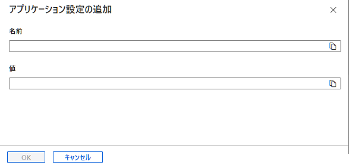

<br>

2つの値が登録されていることを確認 (①)し、上部の「保存」をクリック (②) します。これで設定が反映されます。

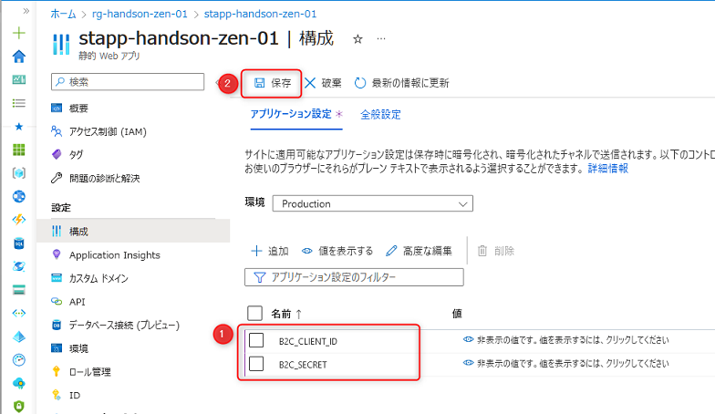

<br>

最後に「概要」をクリック (①) し、この Static Web App の URL をメモしておきます (②) 。後述の "3. Azure AD B2C で設定を追加" セクションで利用します。

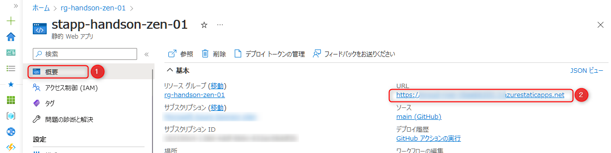

<br>

## 2. プログラムで認証を構成

Azure Static Web Apps は staticwebapp.config.json を構成するだけで認証を組み込むことが可能です。  
ここではその構成を実装します。

### 2-1. staticwebapp.config.json を構成する

Astro プロジェクトの静的サイトのコードを開いた状態の VS Code で、`/packages/` 直下の `frontend` フォルダを右クリック →「New File」をクリックしてファイルを追加します。ファイル名は `staticwebapp.config.json` にします。

※ ファイル名を間違えると Static Web Apps から認識されないので注意です。

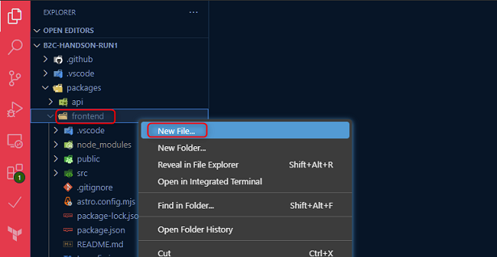

<br>

`frontend` 直下に `staticwebapp.config.json` にあることを確認して開き、以下の内容を貼り付けます。

```json
{
  "$schema": "https://json.schemastore.org/staticwebapp.config.json",
  "routes": [
    {
      "route": "/mypage",
      "allowedRoles": ["authenticated"]
    },
    {
      "route": "/api/auth/*",
      "allowedRoles": ["authenticated"]
    },
    {
      "route": "/login",
      "rewrite": "/.auth/login/aadb2c"
    }
  ],
  "responseOverrides": {
    "401": {
      "redirect": "/login"
    }
  },
  "auth": {
    "identityProviders": {
      "customOpenIdConnectProviders": {
        "aadb2c": {
          "registration": {
            "clientIdSettingName": "B2C_CLIENT_ID",
            "clientCredential": {
              "clientSecretSettingName": "B2C_SECRET"
            },
            "openIdConnectConfiguration": {
              "wellKnownOpenIdConfiguration": ""
            }
          },
          "login": {
            "scopes": ["openid", "profile"]
          }
        }
      }
    }
  }
}
```

`staticwebapp.config.json` の json で、`wellKnownOpenIdConfiguration` の値は空になっています。  
「Azure AD B2C テナントを構成する」のチャプターでメモした「wellKnownOpenIdConfiguration の URL」をここに入力します。

この json の内容を簡単に解説します。

- `routes` 配下でルーティングと認証に関する定義をしています。その一つとして、「mypage」は認証が必要と構成しています。
- `responseOverrides` 配下で、ページにアクセスした際に HTTP 401 (Unauthorized) が返ってきた場合、ログイン画面へリダイレクトするように構成しています。つまり「mypage」へアクセスしたときに認証をしていない状態だとログイン画面に遷移します。
- `auth` 配下で Azure AD B2C の認証を組み込む構成をしています。

> 参考:`staticwebapp.config.json` の構成に関する詳細に興味がありましたら、以下のドキュメントより確認ができます。
>
> - [Azure Static Web Apps を構成する | Microsoft learn](https://learn.microsoft.com/ja-jp/azure/static-web-apps/configuration)

### 2-2.コードを push

VS Code で「Source control」を開き (①) 、コミットメッセージに「認証を構成」と入力 (②) して、「Commit」をクリックします。

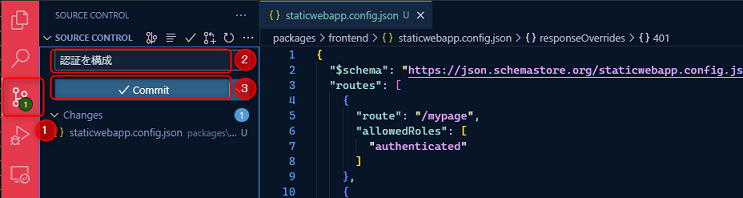

<br>

「Sync Changes」をクリックしてコードを push します。

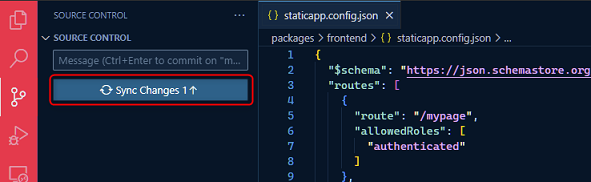

<br>

GitHub のリポジトリを開きコードが push されたことを確認します。push されると、自動で GitHub Actions のワークフローが起動します。  
「Action」をクリックして GitHub Actions が実行されていることを確認します。

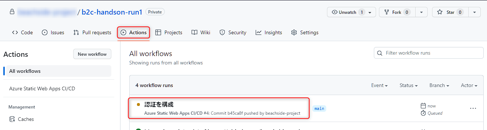

<br>

## 3. Azure AD B2C で設定を追加

次に、Azure AD B2C のテナントで設定を追加します。

Azure ポータルで、右上のテナント名を確認して B2C のテナントを開いていることを確認します。  
「アプリの登録」をクリック (①) し、"Azure AD B2C テナントを構成する" のチャプターで作成したアプリをクリック (②) します。

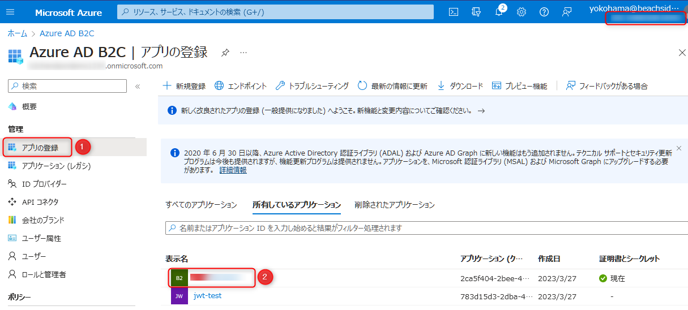

<br>

「認証」 をクリック (①) → 「プラットフォームを追加」をクリック (②) → 「Web」をクリック (③) します。

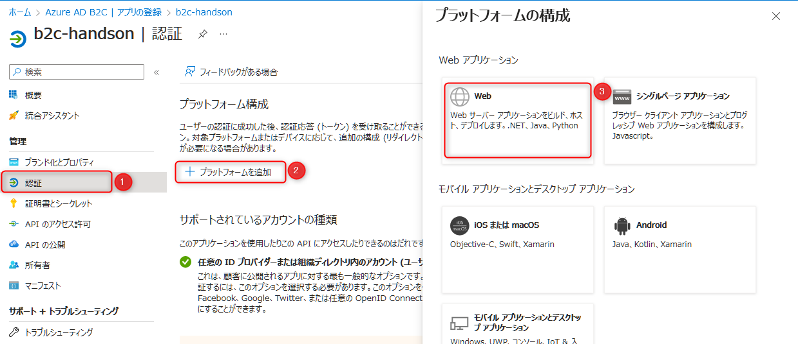

<br>

**リダイレクト URI** の値を入力します。

"1. Static Web App の構成を追加する" セクションでメモした値が `https://xxxx.azurestaticapps.net` の場合、入力する値は以下になります。

- `https://xxxx.azurestaticapps.net/.auth/login/aadb2c/callback`

値を入力して「構成」をクリックします。

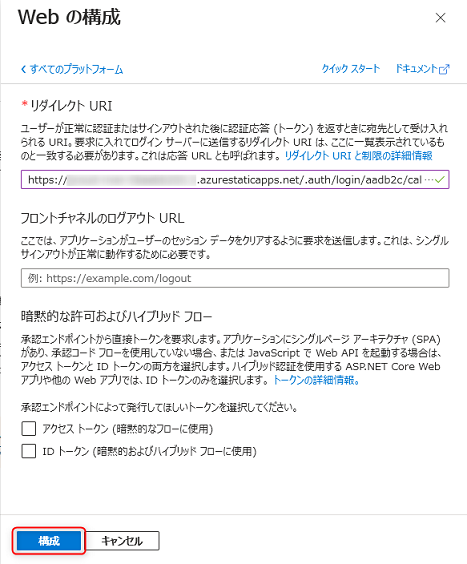

<br>

画面下部の「保存」が押せる状態であればクリックします (押せない状態の場合クリックしなくて問題ありません)。


<br>

## 4. Static Web Apps で動作確認

※ B2C の設定の反映に数分かかることがありますので、ここで小休憩をとりつつ、GitHub Actions の実行の完了も待ちましょう。

GitHub Actions の実行が完了したら動作確認をします。認証はセッションが絡むため Chrome のシークレットウインドウや Microsoft Edge の InPrivate ウインドウ等を起動して、以下3点の動作確認をします。

1点目は、トップページ (`/`) には認証なしでアクセスできることを確認します。

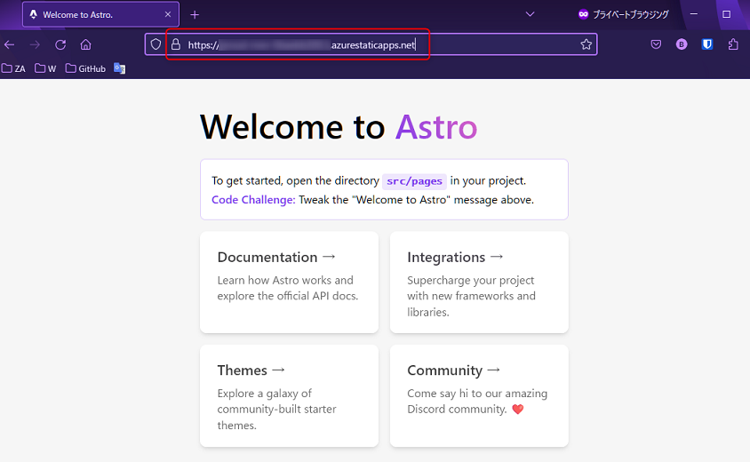

<br>

また、認証されていない状態で`/.auth/me` という Static Web Apps の特別な URL にアクセスすると clientPrincipal が null の状態になります。

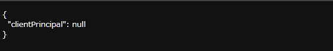

<br>


2点目は、`/mypage` にアクセスすると Azure AD B2C のログイン画面にリダイレクトすることを確認します。  
初回はユーザーがないため、サインアップして認証をします。サインアップ後トップページにリダイレクトします。

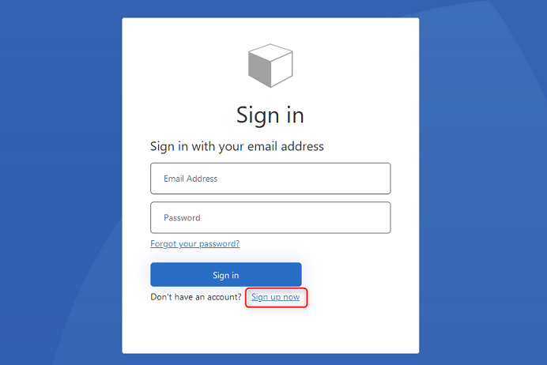

<br>

3点目は、認証した状態になっているため `/mypage` にアクセスすると表示できることを確認します。

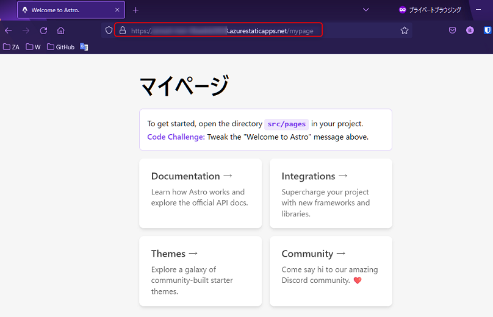

<br>

また、認証した状態で`/.auth/me` にアクセスするとトークンの内容を確認できます。

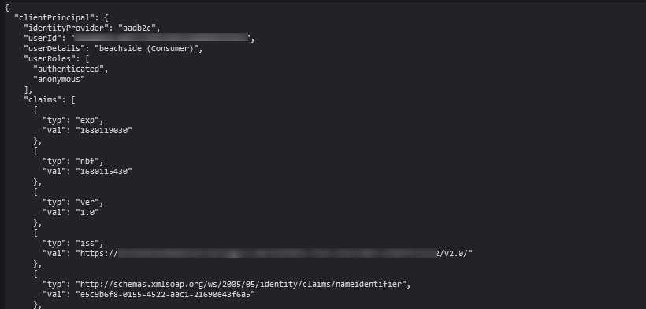

<br>

## ✨ Congratulations ✨

おめでとうございます 🎉 ここでは静的サイトのコードに、json を構成するだけで認証を実現しました。  
シンプルな認証であればフロントエンドで JavaScript を使ったコードを実装することなく認証を実現できるのは、Azure Static Web Apps の特徴の一つです。

次のチャプター以降で、API からデータベースにアクセスして操作をする実装を行います。

----

[⏮️ 前へ](./setup-ad-b2c.md) | [📋 目次](../README.md) | [⏭️ 次へ](./setup-cosmos-db.md)
