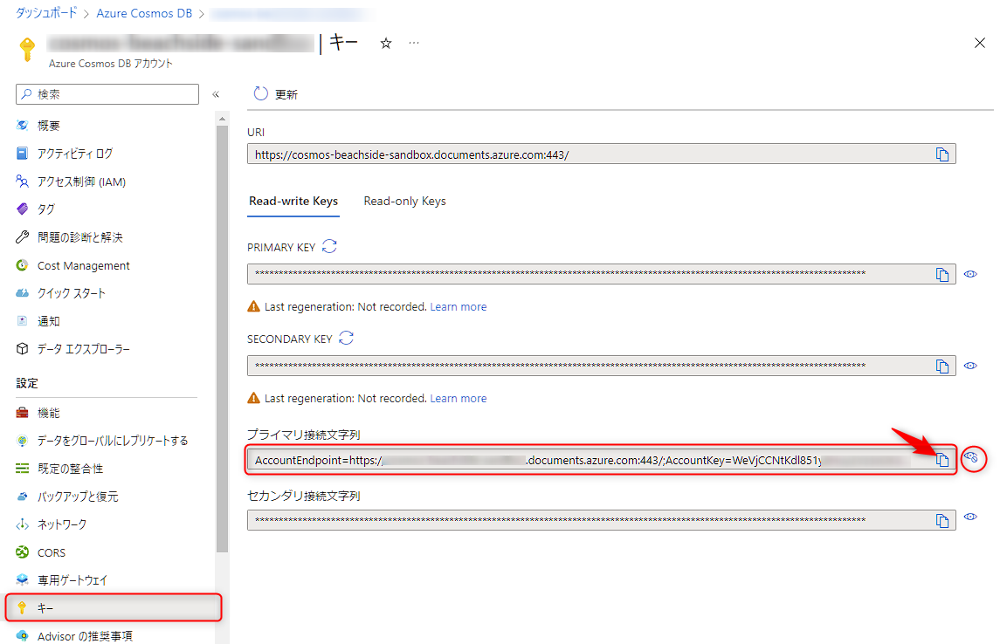

# 🧪 Cosmos DB リソース作成・設定

このチャプターでは、この後に利用する NoSQL の Cosmos DB のリソースを作成します。また、次のチャプターで静的サイトから Cosmos DB にアクセスできるよう、Azure Static Web Apps のリソースに Cosmos DB の接続文字列を設定します。

1. Cosmos DB のリソース作成
1. Azure Static Web Apps のリソースに接続文字列を構成

## 1. Cosmos DB のリソース作成

Azure ポータルから Azure Cosmos DB を作成します。B2C のテナントはないことを確認して Azure ポータルを開きます。

まず、Azure ポータルの左上「リソースの作成」を選択し、「リソースの作成」画面を開きます。検索ボックスに `cosmos` などを入力し、「Azure Cosmos DB」を選択します。

表示された「Azure　Cosmos DB」を選択します。

Azure Cosmos DB のプランの横にある「作成」ボタンを選択します。

いくつかワークロードが提示されるので、ここでは「コア (SQL) - 推奨」の「作成」ボタンを選択し進みます。

「Basics」タブで各設定項目を入力し、「レビュー+作成」ボタン(⑥)を選択し、入力の検証を行います。

| 番号 | タイトル | 説明 |
|----|----|----|
| | プロジェクトの詳細 | |
| ① | サブスクリプション | 利用しているサブスクリプションを指定する |
| ② | リソースグループ | 前述の Azure AD B2C テナントの作成の際に作成したリソースグループを設定する |
| | インスタンスの詳細 | |
| ③ | アカウント名 | 任意のリソース名を入力 |
| ④ | 場所 | 利用する地域に近い場所を選択（たとえば `(Asia Pacific) Japan East` など） |
| ⑤ | 容量モード | 「Serverless」を選択する |

検証が完了したら、「作成」ボタンを選択してリソースを作成します。

リソースの作成が終わったら、「リソースに移動」ボタンから作成した Azure Cosmos DB リソースに移動します。

つぎに、データベースとコンテナを作成します。

左のメニューから「データ エクスプローラー」を開き、「New Container」の右の下矢印を選択し、「New Container」を選択します。

「New Container」ペインで、各設定項目を入力し、「OK」ボタン(④)を選択し、データベースとコンテナを作成します。

| 番号 | タイトル | 説明 |
|----|----|----|
| ① | Database id | 「Create new」を選択し、 `Campaigns` を入力 |
| ② | Container id | `Votes` を入力 |
| ③ | Partition key | `/userId` と入力 |

さいごに、Azure Cosmos DB の接続文字列を控えます。次のセクションで利用します。

Azure Cosmos DB の画面左のメニューから「キー」を開き、右側の目のアイコンをクリックして「プライマリ接続文字列」の値を表示してからコピーして控えておきます。  
文字列を表示せずにコピーすると「*」でコピーされるのでご注意ください。

## 2. Azure Static Web Apps のリソースに接続文字列を構成

Azure Static Web App のリソース画面を開き、左のメニューの「構成」を開きます。「アプリケーション設定」のタブで、「+追加」を選択します。

下記の通りに入力し、「OK」ボタン(③)を選択して、アプリケーション設定の追加を完了します。

| 番号 | 項目 | 説明 |
|----|----|----|
| ① | 名前 | `COSMOS_CONNECTION` を入力 |
| ② | 値 | 前項でコピーした Azure Cosmos DB の接続文字列 |

最後に画面上部の「保存」をクリックします。

 

## ✨ Congratulations ✨

おめでとうございます 🎉 このチャプターでは、Cosmos DB のリソースを作成し、Static Web Apps から利用できるよう接続文字列を構成しました。  
次のチャプターでは API のプログラムをカスタマイズして、Cosmos DB のデータを操作する実装をします。

----

[⏮️ 前へ](./setup-auth.md) | [📋 目次](../README.md) | [⏭️ 次へ](./create-authenticated-data.md)
