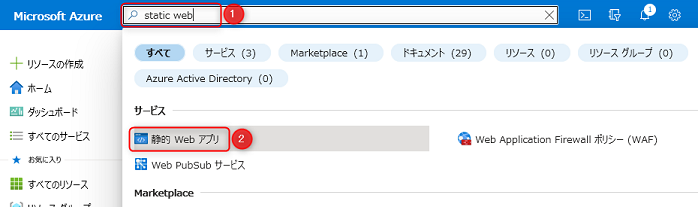
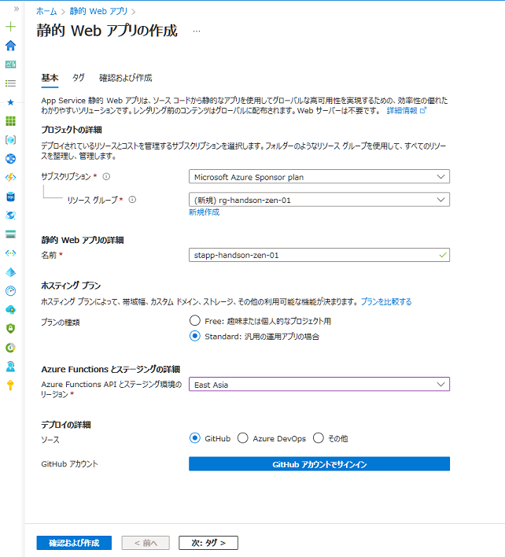
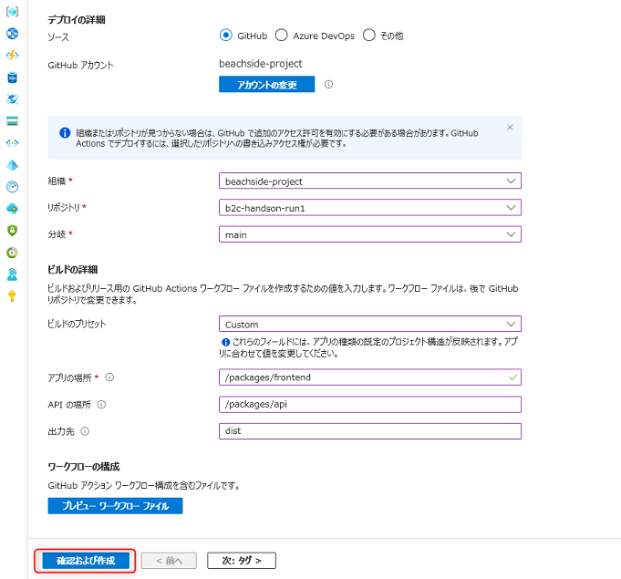
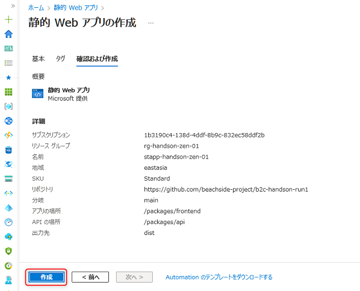
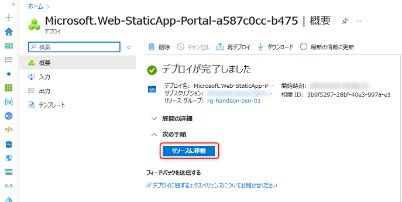
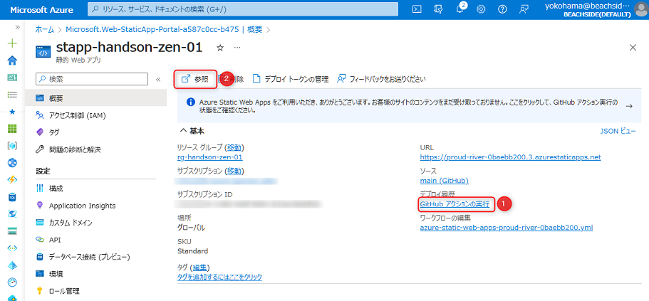
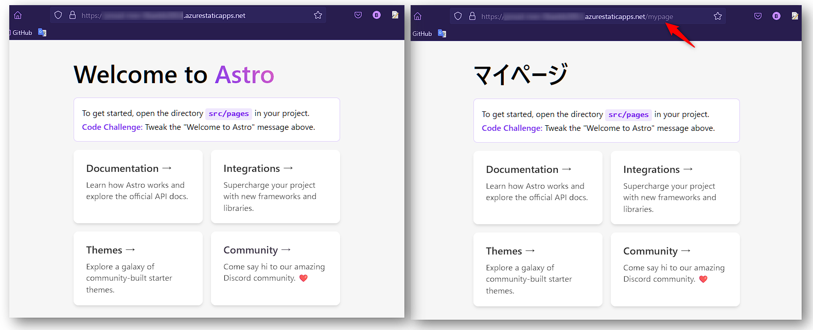
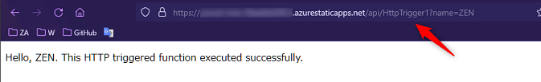

# 🧪 Azure Static Web Apps を構成する

ここでは、Azure で静的サイトをホストするサービスとして最適である Azure Static Web Apps を使い、前章で作成した静的サイトを自動でデプロイします。

1. Azure Static Web Apps のリソース作成と CI/CD
1. Static Web Apps の動作確認

## 1. Azure Static Web Apps のリソース作成と CI/CD

Azure ポータルを開き、上部の検索で「static web」と入力 (①) して「静的 Web アプリ」をクリック (②)します。

 

「作成」をクリックします。

以下を参考に入力します。

プロジェクトの詳細:

- **サブスクリプション**: 今回利用するサブスクリプションが選択されていることを確認します。
- **リソースグループ**: 「新規作成」をクリックし任意の名前を入力します (例: `rg-b2c-handson-01`) 。

静的 Web アプリの詳細:

- **名前**: 任意の名前を入力します。URL になるためグローバルで一意になる必要があります (例: `sttap-b2chandson-zen-001`)。
- **プランの種類**: `Standard` を選択します。今回はカスタム認証の機能を使うため Standard が必須となります。

Azure Function とステージングの詳細:

- **Azure Functions APIとステージング環境のリージョン**: `East Asia` を選択します。

デプロイの詳細:

- **ソース** で`GitHub` を選び、「GitHub アカウントでサインイン」をクリックします。ブラウザで認証の画面が表示されますので、ボタンをおして認証を許可します。

今回利用している GitHub のアカウントで無い場合は、GitHub にアクセスして利用したいアカウントでサインインしなおしてから再度「GitHub アカウントでサインイン」をクリックします。

 

GitHub の情報の入力項目が表示されますので、以下を参考に入力します。

- **ビルドのプリセット**: `Custom` を選択します。
- **アプリの場所**: `/packages/frontend` と入力します。
- **API の場所**: `/packages/api` と入力します。
- **出力先**: `dist` と入力します。

全てを入力したことを確認して「確認および作成」をクリックします。

 

「作成」をクリックします。Static Web Apps のリソース作成と、GitHub のリポジトリでGitHub のリポジトリから Static Web Apps へデプロイするための GitHub Actions のワークフローが作成されます。  
また、作成されたワークフローが起動して Static Web Apps への CI/CD が実行されます。

 

> 参考: GitHub Actions について詳細を知りたい場合は、以下の公式ドキュメントから確認ができます。
>
>- [GitHub Actions を理解する - GitHub Docs](https://docs.github.com/ja/actions/learn-github-actions/understanding-github-actions)

## 2. Static Web Apps の動作確認

作成が終ったら (30秒程度) 、「リソースに移動」をクリックします。

 

GitHub Actions の実行状態は、「GitHub アクションの実行」をクリック (①) すると、GitHub のリポジトリに遷移して確認することが可能です。

GitHub Actions の実行が完了したら、「参照」をクリック (②) して Static Web App にアクセスします。

 

ローカルデバッグで試した時と同様にトップ画面が表示されるか確認してみます。また、 `/maypage` にアクセスしてマイページの画面が表示できるか確認します。

 

次に API へのアクセスを確認します。以下図のように `/api/HttpTrigger1?name=ZEN` にアクセスして、レスポンスが返ってくることを確認します。

 

> 参考: 今回は、Static Web Apps の「マネージド API」の機能で API を構成しています。API の構成方法について興味がありましたら以下のドキュメントから確認が可能です。
>
> - [Azure Static Web Apps での API サポートの概要 | Microsoft Learn](https://learn.microsoft.com/ja-jp/azure/static-web-apps/apis-overview)

## ✨ Congratulations ✨

おめでとうございます 🎉 このチャプターでは、Static Web Apps のリソース作成することで GitHub Actions を利用した Static Web App への CI/CD も自動で構成しました。

これにより、静的サイトをクラウド上に自動でデプロイして、世界へ公開することが実現できました。

次のチャプター以降では、コンシューマーユーザー向けの認証基盤である Azure AD B2C を使い、JavaScript のコードを書くことなくこの静的サイトでの認証を実現していきます。

----

[⏮️ 前へ](./setup-application.md) | [📋 目次](../README.md) | [⏭️ 次へ](./setup-ad-b2c.md)
